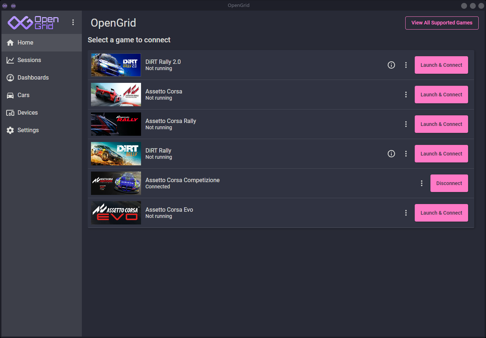
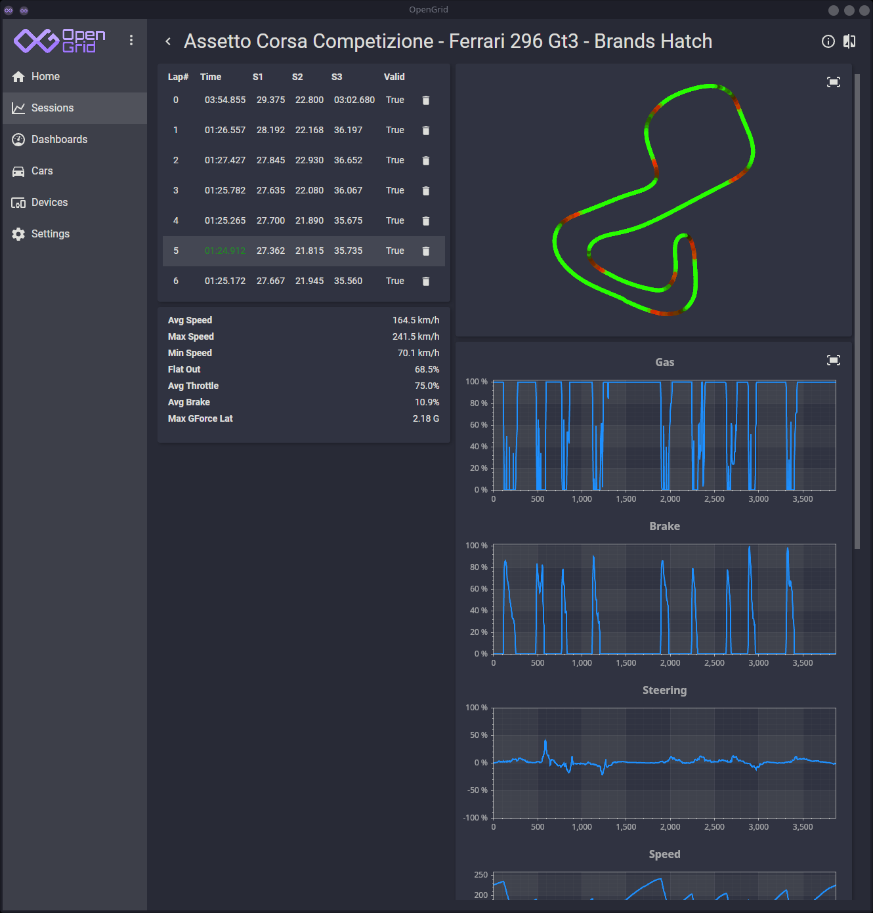
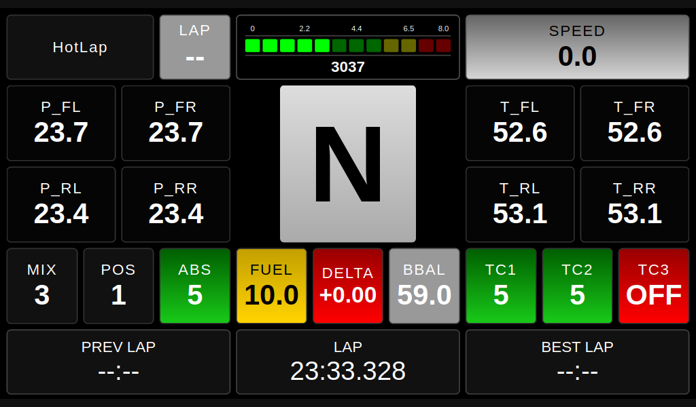

# OpenGrid

A Linux desktop telemetry app for sim racing games. It aims to make use of games telemetry based features easily accesible without complicated installation steps and launch commands. 
Includes and launches shared memory bridge inside games proton prefix.

### Supported games:

- AC
- ACC
- AC Evo
- AC Rally
- Dirt Rally (limited data)
- Dirt Rally2 (limited data)

### Features:

- Launch game and connect to telemetry in one click
- Show live dashboards on the phone, tablet or host machine
- Save sessions in to .csv files, show and compare laps on the charts
- Tray icon
- Color themes
- Few configuration options such as:
  - Automatically connect to the game's telemetry when started
  - Automatically record sessions
  - Automatically launch dashboards on prefered display

### Screenshots





## Architecture

Built with [Avalonia UI](https://avaloniaui.net/) (.NET)

Follows the **MVVM pattern** using `CommunityToolkit.Mvvm` with dependency injection via `Microsoft.Extensions.DependencyInjection`.
Dashboards are built with html and served via http, live data sent via websockets.

## Getting Started

### Prerequisites

- [.NET 10 SDK](https://dotnet.microsoft.com/download)
- [Avalonia UI](https://docs.avaloniaui.net/docs/get-started/)

### Build & Run

```bash
cd src
dotnet restore
dotnet build
dotnet run --project OpenGrid
```

The build automatically publishes `OpenGridBridge` as a single-file Win-x64 executable alongside the main output.

## TODO

- Map more data
- Support and test more games
- Improve sesion analysis screen
- Add devices support
- much more!
